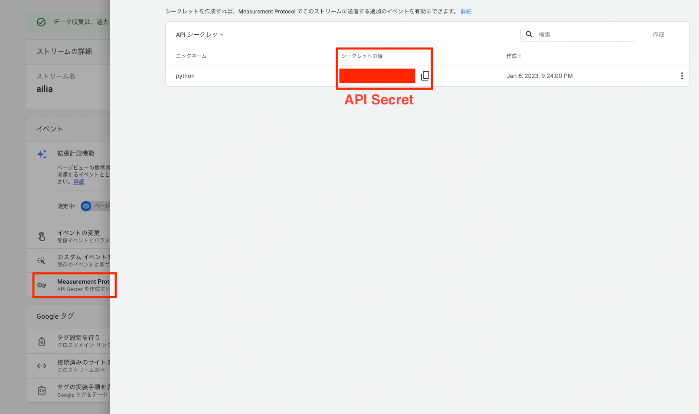
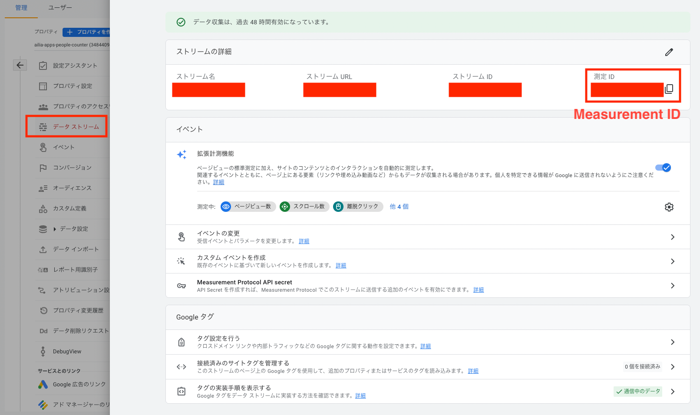
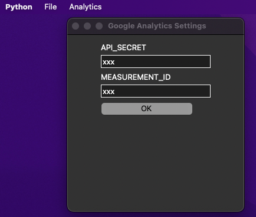
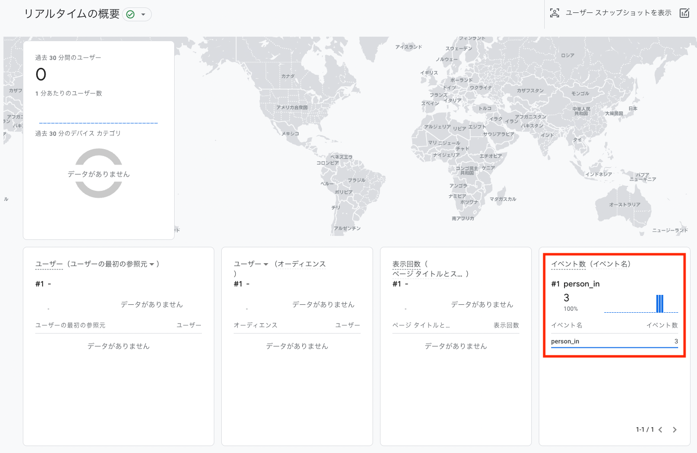

# Connect to Google Analytics

You can send people count information to Google Analytics GA4 using Measurement Protocol.

## Get api secret and measurement id

From GA4 Properties -> Management -> Data Streams, create a Measurement Protocol API secret and get the API Secret. Also, get the Measurement ID from the data stream.

## Set api secret and measurement id

Set the acquired API Secret and Measurement ID from Analytics in the menu bar.

## Run

The measurement results can be confirmed from the real-time analysis event of Google Analytics. As events, person_in and person_out are issued.

