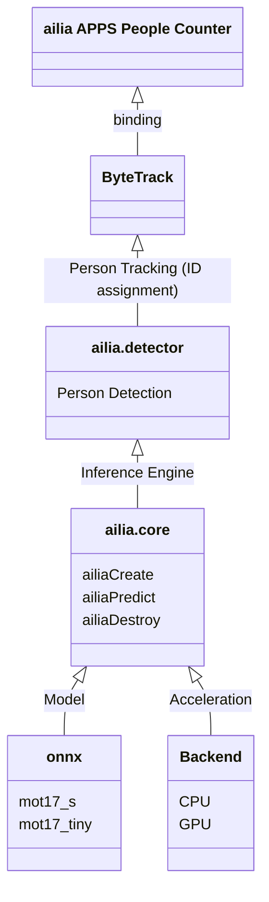

# ailia APPS People Counter

Count the number of people crossing a line from a video using an AI model for people detection and tracking.

[](https://www.youtube.com/watch?v=AvZUIf-nsvg)

## Functions

- People count using line crossing
- Export count to csv

## Requirements

- Windows, macOS, Linux
- Python 3.7 and later
- [ailia SDK](https://github.com/axinc-ai/ailia-models/blob/master/TUTORIAL.md) 1.2.13 and later
- lap (`pip3 install lap`)

## Basic Usage

1. Put this command to open GUI.

```
python3 ailia-apps-people-counter.py
```


2. Push "Input video" button to select input video
3. Push "Set crossing line" button to set crossing line


Click on the screen to draw two lines.

4. Push "Run" button to execute the app


Count (out) is incremented when passing through the line of in to go out. Count (in) is incremented when passing through the line of out to go in.

## Other functions

### Write output to video and csv

a. Push "Output video" button to select output video
b. Push "Output csv" button to select output csv

The examples of csv file.

```
time(sec) , count(in) , count(out) , total_count(in) , total_count(out)
0 , 0 , 0 , 0 , 0
1 , 1 , 1 , 1 , 1
2 , 1 , 1 , 2 , 2
```

### Use webcam

Please add `--camera 0` option when open GUI.

```
python3 ailia-apps-people-counter.py --camera 0
```

## Architecture



## Test video

https://pixabay.com/videos/segway-scooter-people-move-28146/
