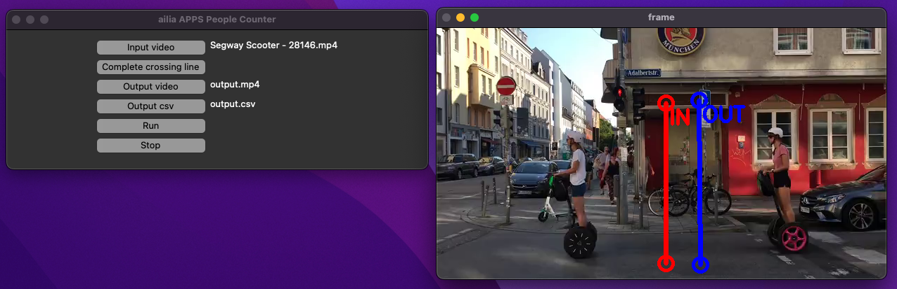
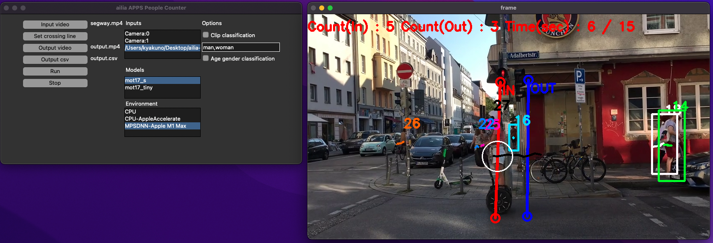
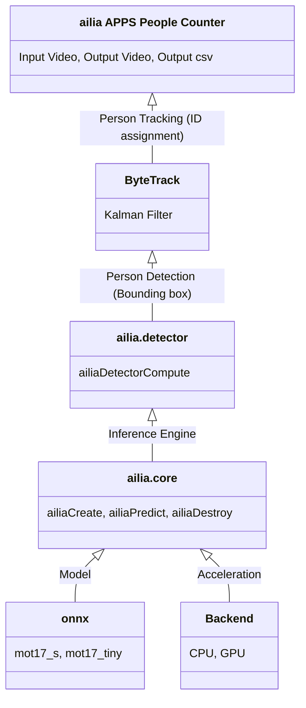

# ailia APPS People Counter

Count the number of people crossing a line from a video using an AI model for people detection and tracking.

[](https://www.youtube.com/watch?v=AvZUIf-nsvg)

## Functions

- People count using line crossing
- Export count to csv

## Options

- Clip classification
- Age gender classification
- Person attributes classification
- Google Analytics connection

## Requirements

- Windows, macOS, Linux
- Python 3.7 and later
- [ailia SDK](https://github.com/axinc-ai/ailia-models/blob/master/TUTORIAL.md) 1.2.13 and later
- lap (`pip3 install lap`)
- ftfy (`pip3 install ftfy`) if you use clip

## Basic Usage

1. Put this command to open GUI.

```
python3 ailia-apps-people-counter.py
```


2. Push "Input video" button to select input video
3. Push "Set crossing line" button to set crossing line



Click on the screen to draw two lines.

4. Push "Run" button to execute the app



Count (out) is incremented when passing through the line of in to go out. Count (in) is incremented when passing through the line of out to go in.

## Other functions

### Write output to video and csv

a. Push "Output video" button to select the path for video
b. Push "Output csv" button to select the path for csv
c. Push "Output image" button to select the folder for detected image

The examples of csv file.

```
sec , time, count(in) , count(out) , total_count(in) , total_count(out)
0 , 2023-02-18 12:32:52.289135 , 0 , 0 , 0 , 0
1 , 2023-02-18 12:32:53.794513 , 1 , 1 , 1 , 1
2 , 2023-02-18 12:32:55.195774 , 1 , 1 , 2 , 2
```

### Vehicle count

Vehicles can be counted by specifying vehicle as the category. The model must specify yolo. Among yolo categories, count car, truck, and bus as vehicles.

### Google Analytics Connection

You can send people count information to Google Analytics GA4 using Measurement Protocol.

[Connect to Google Analytics](ANALYTICS.md)

### IP camera connection

You can set IP camera address from camera settings of menu bar.
Please try to set these kind of ip camera address.

`rtsp://wowzaec2demo.streamlock.net/vod/mp4:BigBuckBunny_115k.mp4`

## Architecture



## FAQ

### I want to detect multiple categories in a clip

Multiple categories can be specified by separating the category names with #.

```
man,woman#younger,older
```

### UI not visible in DarkMode on macOS

Use brew's python3.10.

```
brew install python@3.10
brew install python-tk@3.10
pip3.10 install -r requrements.txt
python3.10 ailia-people-counter.py
```

### Failed to install lap

Use python3.10 instead of python3.11.

## Test video

https://pixabay.com/videos/segway-scooter-people-move-28146/
