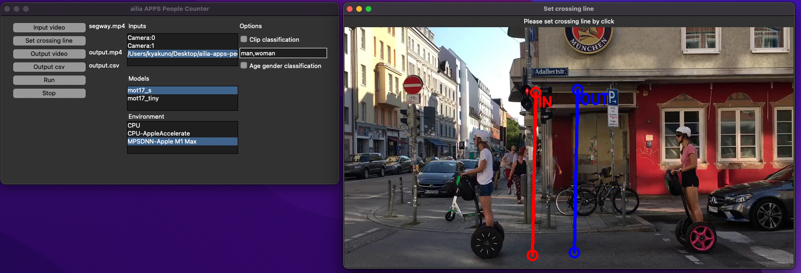

# ailia APPS People Counter

Count the number of people crossing a line from a video using an AI model for people detection and tracking.

[](https://www.youtube.com/watch?v=AvZUIf-nsvg)

## Functions

- People count using line crossing
- Export count to csv

## Requirements

- Python 3.7 and later
- ailia SDK 1.2.13 and later
- lap (pip3 install lap)

## Basic Usage

1. Put this command to open GUI.

```
python3 ailia-apps-people-counter.py
```


2. Push "Input video" button to select input video
3. Push "Set crossing line" button to set crossing line



4. Push "Run" button to execute the app


## Write output to video and csv

1. Push "Output video" button to select output video
2. Push "Output csv" button to select output csv

## Csv format

```
time(sec) , count(in) , count(out) , total_count(in) , total_count(out)
0 , 0 , 0 , 0 , 0
1 , 1 , 1 , 1 , 1
2 , 1 , 1 , 2 , 2
3 , 0 , 0 , 2 , 2
4 , 0 , 2 , 2 , 4
5 , 1 , 0 , 3 , 4
6 , 0 , 0 , 3 , 4
7 , 1 , 0 , 4 , 4
8 , 1 , 0 , 5 , 4
9 , 1 , 0 , 6 , 4
10 , 1 , 0 , 7 , 4
11 , 0 , 0 , 7 , 4
12 , 0 , 0 , 7 , 4
13 , 0 , 0 , 7 , 4
14 , 0 , 1 , 7 , 5
15 , 0 , 0 , 7 , 5
```

## Counting scheme

Count (out) is incremented when passing through the line of in to go out. Count (in) is incremented when passing through the line of out to go in.

## Test video

https://pixabay.com/videos/segway-scooter-people-move-28146/
